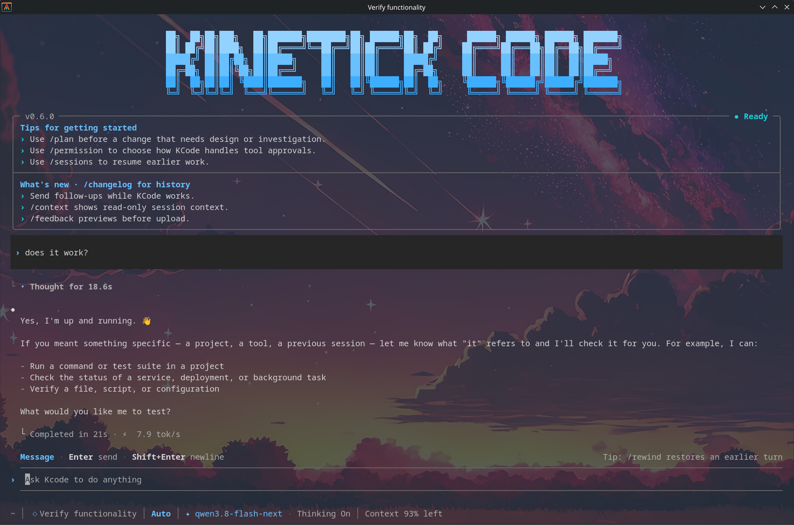

<p align="center">
  <picture>
    <source media="(prefers-color-scheme: dark)" srcset="docs/assets/wordmark-dark.svg">
    <source media="(prefers-color-scheme: light)" srcset="docs/assets/wordmark-light.svg">
    
  </picture>
</p>

<h1 align="center">Kinetick Code (fork)</h1>
<p align="center">A terminal coding agent with MiniMax, your own models, and tools beyond code.</p>

> [!IMPORTANT]
> **This is a community fork of [`MiniMax-AI/minimax-code`](https://github.com/MiniMax-AI/minimax-code)** maintained at
> [`tournierjc/kinetick-code`](https://github.com/tournierjc/kinetick-code). It merges upstream regularly and enforces
> fork-specific boundaries (no telemetry, no managed-service clients — see [Network egress](#network-egress)).
> The official `filecdn.minimax.chat` one-command installer and the public `@minimax-ai/code` npm package deliver
> **upstream** builds — they do not contain this fork's changes. To run this fork, install the verified archive from
> [fork Releases](https://github.com/tournierjc/kinetick-code/releases) or build from this source. See
> [docs/releasing.md#fork-release-process-tournierjckinetick-code](docs/releasing.md#fork-release-process-tournierjckinetick-code) for how releases are produced.
> **Renamed:** this fork was `tournierjc/minimax-code-fork` and its command was `mcode`. GitHub redirects the old
> URLs, but the current command is **`kcode`** and release archives are named `kinetick-code-<version>.tar.gz`.
> An `mcode` launcher from an earlier install keeps working until you install a current archive; see
> [installation](docs/installation.md#renamed-from-minimax-code-fork).
<p align="center">
  <a href="#quick-start">Get started</a> ·
  <a href="docs/README.md">Documentation</a> ·
  <a href="docs/examples.md">Examples</a> ·
  <a href="CONTRIBUTING.md">Contributing</a>
</p>
<p align="center"><strong>English</strong> · <a href="README_ZH.md">简体中文</a></p>
<p align="center">
  
  
  <a href="LICENSE-STATUS.md"></a>
</p>

Understand a project, make changes, and run tests from your terminal. Use your MiniMax account or bring your own model, with search, plugins, and multimodal tools in the same workflow.

[](docs/demo.md)

<p align="center"><a href="docs/demo.md">Watch the 20-second demo →</a> · Real terminal output, with pauses shortened</p>

## Quick start

### 1. Install KCode

**This fork — GitHub Release archive (recommended).** Download the archive and checksum from the
[latest fork release](https://github.com/tournierjc/kinetick-code/releases/latest), verify the checksum, and install
with npm. Node.js **22.19+ (22.x), 24.2+ (24.x), 25, or 26** is required; npm still needs network access to public
npm for runtime dependencies. For a `vX.Y.Z` release:

```bash
# Linux; on macOS use: shasum -a 256 -c kinetick-code-X.Y.Z.tar.gz.sha256
sha256sum -c kinetick-code-X.Y.Z.tar.gz.sha256
npm install --global ./kinetick-code-X.Y.Z.tar.gz --registry=https://registry.npmjs.org/ --include=optional --ignore-scripts=false --allow-scripts=better-sqlite3
kcode --version
```

The archive passed the full CI verification and npm-install checks on Linux and macOS across the supported Node
lines before publication, and its release notes carry the source commit and SHA-256. See
[install a fork release archive](docs/installation.md#install-a-github-release-archive) and
[fork release process](docs/releasing.md#fork-release-process-tournierjckinetick-code).

**Alternative — build from this source.** See [Build from source](#build-from-source) below.

**Upstream channels (not this fork).** The official installer and public npm package track upstream only:

- macOS / Linux / WSL: `curl -fsSL https://filecdn.minimax.chat/public/install.sh | bash`
- Windows (PowerShell): `irm https://filecdn.minimax.chat/public/install.ps1 | iex`
- npm: `npm install -g @minimax-ai/code@latest --registry=https://registry.npmjs.org/ --ignore-scripts=false --include=optional --allow-scripts=@minimax-ai/code,better-sqlite3`

These install into `~/.minimax-code` (POSIX) or `%USERPROFILE%\.minimax-code` (Windows) with launchers `bin/kcode` /
`bin/mcode-tools`. Use them only when you explicitly want an upstream build without this fork's changes; installing
through them replaces a fork installation. The built-in updater installs this fork's releases only, see
[Updating](docs/installation.md#updating). See [Uninstall](#uninstall) to remove the CLI.

Reopen your terminal and check the installation:

```bash
kcode --version
kcode --help
```

See the official [quick start](https://agent.minimax.io/docs/cli/quick-start), [features](https://agent.minimax.io/docs/cli/features), and [troubleshooting](https://agent.minimax.io/docs/cli/faq).

### 2. Sign in or bring your own API key

For a mainland China account:

```bash
kcode login
```

For a Global account:

```bash
kcode login --region global
```

Complete sign-in in your browser, then open `kcode` and use `/status` to check your account and `/provider` to choose a model. Run `kcode logout` to sign out.

Token Plan requires an account with available credits. Builds from this repository and the published npm CLI `@minimax-ai/code@0.4.12` default to `~/.minimax` for user data (or `~/.minimax-<profile>` when a profile is selected). `MINIMAX_DATA_DIR` or `MAVIS_DATA_DIR` can override the data directory. The installer's `~/.minimax-code` installation directory is separate from this choice. See [Accounts and data](docs/installation.md#accounts-and-data) before locating or removing configuration and sessions.

<details>
<summary>Use your own API key (BYOK)</summary>

BYOK does not require a MiniMax login. Set `MCODE_PROVIDER_API_KEY` in your current shell, then add a provider. Replace the example URL and model name with your provider's values:

```bash
kcode provider add --name my-provider --base-url https://example.com/v1 \
  --api-format openai-completions --model my-model \
  --api-key-env MCODE_PROVIDER_API_KEY --use
kcode
```

`--use` tests the first listed model before saving and selecting it. A failed connection test saves nothing. Omit `--use` to save without testing or changing the default model. For custom/local models, add `--context-limit 32768 --output-limit 4096` (use your server's actual limits). Each value must be a positive safe integer and applies to every repeated `--model`. Inspect configured limits with `kcode provider list --json`. Omitting these flags preserves the existing model-limit defaults.

Supported API formats: `openai-completions`, `openai-responses`, and `anthropic-messages`. An endpoint that needs no authentication — a server you run locally, typically — is a provider without a key: omit `--api-key-env`, leave `MCODE_PROVIDER_API_KEY` unset, and the connection is stored with no credential, so no request to it carries one. See the [model examples](docs/examples.md#2-choose-your-own-model) for environment variable setup, connection checks, and model overrides for a single run.

</details>

### 3. Run your first task

Open the project you want to work on:

```bash
cd /path/to/your/project
kcode
```

Describe your task in the TUI, or submit it directly when you launch KCode:

```bash
kcode "Find a failing test, fix the implementation, and run the relevant tests."
```

Use `kcode init .` to generate or update project guidance in `AGENTS.md`. Describe the expected result, allowed changes, and how to verify the task.

| Entry point | Command | Use it for |
| --- | --- | --- |
| Interactive TUI | `kcode [prompt]` | Explore code, continue a conversation, and review changes or permissions. |
| Headless | `kcode exec [prompt]` | Shell scripts, CI, batch work, and evaluations. |
| ACP | `kcode acp` | Editors and clients supporting Agent Client Protocol. |

See [harness integration](docs/harness-integration.md) for the `exec` and ACP
contracts a script, CI job, or client depends on: output formats, exit codes,
session continuation, and how approvals are answered.

### Continue your work

```bash
# Resume the latest session in the current workspace
kcode --continue

# Open the session picker
kcode --session
```

Inside the TUI, use `/sessions` to find previous sessions and `/help` to see all commands and shortcuts.

| Action | Shortcut |
| --- | --- |
| Send a message or steer the running task | `Enter` |
| Queue a follow-up while a task is running | `Alt+Enter` |
| Insert a newline | `Shift+Enter` |
| Reference a workspace file or directory | `@` |
| Toggle Plan Mode | `Shift+Tab` |
| Switch permission modes | `Alt+M` |
| Close a panel or interrupt a running task; interrupting before the model replies returns the message to the composer | `Esc` |

## Uninstall

Close running KCode sessions, including editor integrations, before uninstalling. First locate the command with `command -v kcode` (macOS / Linux / WSL) or `Get-Command kcode -All` (PowerShell), then follow the matching installation method below. The current official install scripts do **not** provide an uninstall flag.

### Installed with the script

The commands below remove the default installation directory, including both launchers, downloaded releases, and any installer-managed Node.js runtime. If you used `MCODE_INSTALL_DIR`, substitute the actual installation directory. Inspect it first: earlier source builds used `~/.minimax-code` for user data, and a custom data directory can overlap the installation. Back up any configuration or sessions you want to keep before deleting it.

**macOS / Linux / WSL**

```bash
rm -rf -- "$HOME/.minimax-code"
```

Remove the `# Kinetick Code CLI` comment and its following PATH line from the shell file the installer updated: `~/.zshrc` for zsh; the first existing file among `~/.bashrc`, `~/.bash_profile`, and `~/.profile` for bash (or a newly created `~/.bashrc`); `~/.config/fish/config.fish` for fish; or `~/.profile` for other shells. The line is `export PATH="/absolute/install/path/bin:$PATH"`, or `fish_add_path -g "/absolute/install/path/bin"` for fish. Remove only the KCode entry, preserving other PATH settings. The installer skips this edit when `MCODE_NO_MODIFY_PATH` is set or the path is already present.

**Windows (PowerShell)**

```powershell
Remove-Item -LiteralPath "$env:USERPROFILE\.minimax-code" -Recurse -Force
```

Open **Edit environment variables for your account**, edit the user **Path**, and remove only the installation directory entry (by default `%USERPROFILE%\.minimax-code`, which may appear as an expanded absolute path). The Windows installer updates the user Path, not the PowerShell profile; `MCODE_NO_MODIFY_PATH` skips that persistent update.

### Installed with npm or from source

For a global npm installation, use the same npm installation/prefix you used to install KCode:

```bash
npm uninstall -g kinetick-code
```

An installation made before this product took its own name is `@minimax-ai/code`; uninstall that one the
same way if it is still on disk.

For a source build, save any work and remove only the checkout you created; see [Update or remove](docs/installation.md#update-or-remove).

After uninstalling, reopen your terminal (fully restart the editor for integrated terminals) and run `command -v kcode` or `Get-Command kcode -All` again. No result means the command is no longer on PATH. If another copy appears, identify its installation method before removing it.

### Optional: delete user data

Removing the program leaves separately stored user data in place. To also delete local login state, provider configuration, caches, and sessions, first confirm the selected directory using [Accounts and data](docs/installation.md#accounts-and-data) and back up anything you need. Other KCode installations can share this directory. For the default `~/.minimax` directory only:

```bash
# macOS / Linux / WSL — permanently deletes the default user data
rm -rf -- "$HOME/.minimax"
```

```powershell
# Windows — permanently deletes the default user data
Remove-Item -LiteralPath "$env:USERPROFILE\.minimax" -Recurse -Force
```

A profile uses `~/.minimax-<profile>`; `MINIMAX_DATA_DIR` or `MAVIS_DATA_DIR` can select a different location. Remove only the specific directories you intend to discard, without wildcard deletion. Remove any KCode-specific environment variable assignments you added to shell profiles or user environment settings if you no longer need them.

## Network egress

This fork ships no telemetry and no managed-service client, and it decides every
outbound connection before opening a socket. By default the MiniMax
managed-service and reporting hosts are refused; loopback and the model
endpoints you configured stay reachable. Use `MCODE_EGRESS_MODE=allowlist` to
reach only loopback, your providers, and `MCODE_ALLOWED_ORIGINS`. See
[docs/egress-policy.md](docs/egress-policy.md).
## What you can do

| Task | Capabilities |
| --- | --- |
| **Edit and verify code** | Read files, inspect diffs, run shell commands and tests, and control tool execution with permissions and sandboxing. |
| **Choose your model** | Use a MiniMax account / Token Plan, or custom providers with OpenAI- or Anthropic-compatible API formats. |
| **Search and work with media** | Use built-in search, `mcode-tools` media tools, MCP, and managed connectors, subject to account access and service credits. |
| **Keep work moving** | Resume sessions, plan tasks, use subagents, and extend the agent with official, local, or GitHub plugins and built-in skills. |
| **Connect your workflow** | Run scripted tasks with the headless CLI, or connect compatible editors and clients through ACP. |

Account features, updates, feedback, and diagnostics are also included. Managed tools require network access and the relevant authorization. See [capabilities and service boundaries](docs/tui-capabilities.md) for details.

## Try it

Start the TUI in a copy of the example project and enter:

> Read clamp.mjs and clamp.test.mjs. Run node --test to reproduce the failure, fix clamp without changing the tests, then run the tests again.

The [small, reproducible project](examples/clamp) is the same task used in the demo above. [More examples](docs/examples.md) cover switching models, calling real search, and using your own image inputs.

## Build from source

To develop KCode or run this fork's source, clone **this** repository (not upstream) and use Git, **Node.js 22.19+ (22.x), 24.2+ (24.x), 25, or 26**, and **pnpm 9.12.0**. On Windows, keep the checkout on a local NTFS volume and outside cloud-synced folders; the preflight command below checks the volume before pnpm creates workspace links.
```bash
git clone https://github.com/tournierjc/kinetick-code.git
cd minimax-code
node scripts/check-windows-source-location.mjs
pnpm install --frozen-lockfile
pnpm build
pnpm kcode
```

The first build requires an internet connection. Dependencies and the integrity-checked `mcode-tools` bundle come from public npm. See the [source installation guide](docs/installation.md) for pnpm setup, system dependencies, and updates.

From the source directory, use `pnpm kcode` in place of `kcode` in the examples above. To work on your own project, open its directory and launch the built CLI:

```bash
node /absolute/path/to/kinetick-code/dist/cli.js
```

This repository targets the **0.4.12 source preview**. Installing the published package and building this checkout are separate paths. Matching versions do not prove identical build provenance; see the [version and evidence baseline](docs/open-source-status.md#version-and-evidence-baseline).

## Documentation and contributing

- [Installation and updates](docs/installation.md) · [Examples](docs/examples.md) · [TUI status line](packages/tui/docs/status-line-config.md)
- [Contributor guide](CONTRIBUTING.md) · [Report a bug or propose an idea](https://github.com/MiniMax-AI/minimax-code/issues/new/choose) · [Report a security issue](SECURITY.md)
- [All documentation](docs/README.md): architecture, capability coverage, verification records, source synchronization, and release preparation.

English is the primary documentation language. The [Chinese README](README_ZH.md) mirrors this page.

For now, code and documentation pull requests are accepted only from repository collaborators. If you are not a collaborator but have an idea or proposal, please [open an issue](https://github.com/MiniMax-AI/minimax-code/issues/new/choose) so we can discuss it. Remove secrets, account details, and private project content from reports.

## Desktop app and support

<a href="https://agent.minimax.io/download" title="Download Kinetick Code">
  
</a>

[Download for macOS or Windows](https://agent.minimax.io/download) · [Report a problem or ask a question](https://github.com/MiniMax-AI/minimax-code/issues/new/choose)

This repository also hosts issue reporting for the Kinetick Code desktop app. The published source covers the terminal TUI, headless CLI, and ACP; it does not include the desktop application's source. Select the affected product when filing an issue. For a desktop bug, include the app version, operating system, and a log upload ID if available from **Settings → General → Upload logs**. For a CLI bug, include `kcode --version`, your interface, and a minimal reproduction. Remove credentials and private project content from reports.

## License

First-party code defaults to [MIT](LICENSE). Existing file-level and package-level licenses remain in place. See [third-party notices](THIRD_PARTY_NOTICES.md) and [license status](LICENSE-STATUS.md) for dependencies, assets, and `mcode-tools`.
