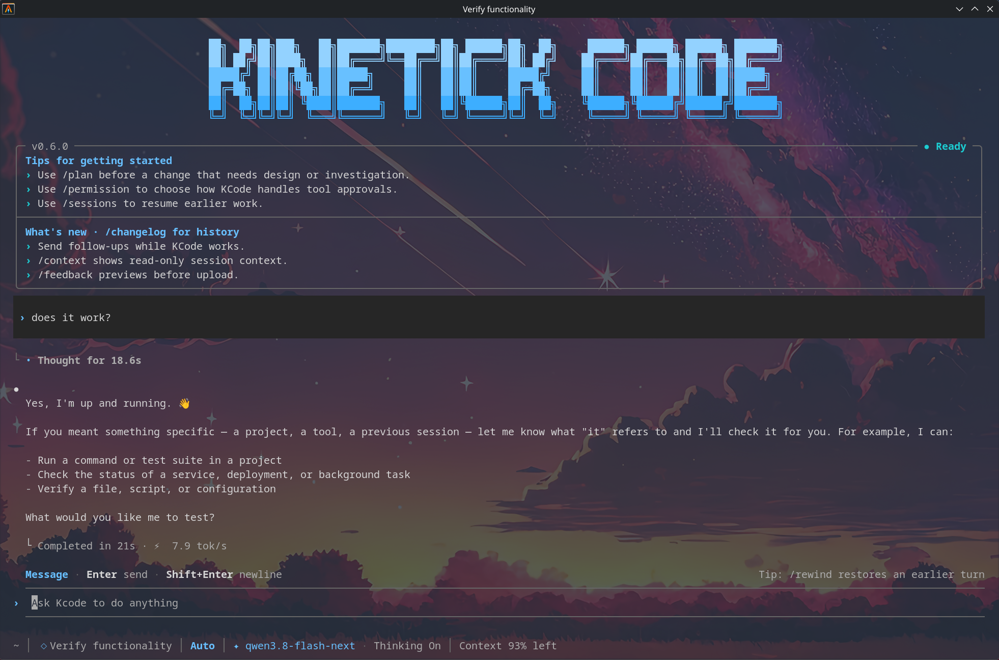

<p align="center">
  <picture>
    <source media="(prefers-color-scheme: dark)" srcset="docs/assets/wordmark-dark.svg">
    <source media="(prefers-color-scheme: light)" srcset="docs/assets/wordmark-light.svg">
    
  </picture>
</p>

<h1 align="center">Kinetick Code (fork)</h1>
<p align="center">A terminal coding agent based on MiniMax Code, running your own models, and tools beyond code.</p>

> [!IMPORTANT]
> **Kinetick Code** is a community fork of [`MiniMax-AI/minimax-code`](https://github.com/MiniMax-AI/minimax-code),
> maintained at [`tournierjc/kinetick-code`](https://github.com/tournierjc/kinetick-code). It merges upstream regularly
> and enforces fork-specific boundaries (no telemetry, no managed-service clients — see [Network egress](#network-egress)).
>
> **Install this product** from verified archives on
> [this repository's GitHub Releases](https://github.com/tournierjc/kinetick-code/releases)
> (`kinetick-code-<version>.tar.gz` + `.sha256`), or [build from this source](#build-from-source).
> Upstream MiniMax installers and the public npm package `@minimax-ai/code` deliver **upstream** builds without
> these changes — do not use them for Kinetick Code. Release process:
> [docs/releasing.md](docs/releasing.md#fork-release-process-tournierjckinetick-code).
>
> **What Kinetick Code adds:** Session tabs with background multitasking (turns keep running and streaming when you switch away),
> provider setup for OpenRouter, DeepSeek, GitHub Copilot, and keyless local endpoints, session-wide cost tracking in the
> status line and `/usage`, Skill and Memory management with human review (not inherited from upstream), an independent
> update channel, and no telemetry — see [Session tabs](#session-tabs-and-multitasking),
> [Skill and Memory management](#skill-and-memory-management), and [Network egress](#network-egress).
<p align="center">
  <a href="#quick-start">Get started</a> ·
  <a href="docs/README.md">Documentation</a> ·
  <a href="docs/examples.md">Examples</a> ·
  <a href="CONTRIBUTING.md">Contributing</a>
</p>
<p align="center">
  
  
  <a href="LICENSE-STATUS.md"></a>
</p>

Understand a project, make changes, and run tests from your terminal. Use your MiniMax account or bring your own model or provider, with search, plugins, and multimodal tools in the same workflow.

<p align="center">
  
</p>

Give a blinking pocket pet a focus timer, then ask for a long-press pause and a celebration when the timer ends. The [Pocket Pet example](examples/pocket-pet) runs locally in the browser, with no frontend dependencies and no extra hardware. The finished page needs no model account. Asking Kinetick Code to edit the starter uses the provider you already configured; model calls may incur charges.

<p align="center"><a href="docs/demo.md">Recording notes →</a> · <a href="examples/pocket-pet">Build it yourself →</a></p>

## Quick start

### 1. Install KCode

**GitHub Release archive (recommended).** Download the archive and checksum from
[this repository's latest release](https://github.com/tournierjc/kinetick-code/releases/latest), verify the checksum, and install
with npm. Node.js **22.19+ (22.x), 24.2+ (24.x), 25, or 26** is required; npm still needs network access to public
npm for runtime dependencies. For a `vX.Y.Z` release:

```bash
# Linux; on macOS use: shasum -a 256 -c kinetick-code-X.Y.Z.tar.gz.sha256
sha256sum -c kinetick-code-X.Y.Z.tar.gz.sha256
npm install --global ./kinetick-code-X.Y.Z.tar.gz --registry=https://registry.npmjs.org/ --include=optional --ignore-scripts=false --allow-scripts=better-sqlite3
kcode --version
```

The archive passed the full CI verification and npm-install checks on Linux and macOS across the supported Node
lines before publication, and its release notes carry the source commit and SHA-256. See
[install a release archive](docs/installation.md#install-a-github-release-archive) and
[fork release process](docs/releasing.md#fork-release-process-tournierjckinetick-code).

**Alternative — build from this source.** See [Build from source](#build-from-source) below.

Reopen your terminal and check the installation:

```bash
kcode --version
kcode --help
```

See [installation](docs/installation.md), [examples](docs/examples.md), and [TUI capabilities](docs/tui-capabilities.md).
`kcode update` installs only releases published by this repository; see [Updating](docs/installation.md#updating).

### 2. Choose a provider or sign in

Start with **`/provider`** (or `kcode provider` from a shell). It works for any connection the runtime supports:
OpenRouter, DeepSeek, GitHub Copilot, local keyless endpoints, custom OpenAI-/Anthropic-compatible APIs, and MiniMax
when available. Use `/model` to pick a model once a provider is connected, and `/status` to inspect the active setup.

<details>
<summary>Bring your own API key (BYOK)</summary>

BYOK does not require a MiniMax login. Set `MCODE_PROVIDER_API_KEY` in your current shell, then add a provider.
Replace the example URL and model name with your provider's values:

```bash
kcode provider add --name my-provider --base-url https://example.com/v1 \
  --api-format openai-completions --model my-model \
  --api-key-env MCODE_PROVIDER_API_KEY --use
kcode
```

`--use` tests the first listed model before saving and selecting it. A failed connection test saves nothing. Omit `--use` to save without testing or changing the default model. For custom/local models, add `--context-limit 32768 --output-limit 4096` (use your server's actual limits). Each value must be a positive safe integer and applies to every repeated `--model`. Inspect configured limits with `kcode provider list --json`. Omitting these flags preserves the existing model-limit defaults.

Supported API formats: `openai-completions`, `openai-responses`, and `anthropic-messages`. An endpoint that needs no authentication — a server you run locally, typically — is a provider without a key: omit `--api-key-env`, leave `MCODE_PROVIDER_API_KEY` unset, and the connection is stored with no credential, so no request to it carries one. See the [model examples](docs/examples.md#2-choose-your-own-model) for environment variable setup, connection checks, and model overrides for a single run.

</details>

<details>
<summary>Optional: MiniMax account / Token Plan</summary>

If you use MiniMax OAuth or Token Plan, run `kcode login` (optional `--region cn|global` when your account needs it),
complete sign-in in the browser, then use `/status` and `/provider`. Sign out with `kcode logout`. Token Plan needs
an account with available credits.

</details>

User data for builds from this repository defaults to `~/.kinetick` (or `~/.kinetick-<profile>` when a profile is
selected). Older installs may still use `~/.minimax`; on upgrade the runtime migrates that directory or leaves a
compatibility link. `KINETICK_DATA_DIR`, `MINIMAX_DATA_DIR`, or `MAVIS_DATA_DIR` can override the data directory.
That path is separate from where npm installs the `kinetick-code` package. See
[Accounts and data](docs/installation.md#accounts-and-data) before locating or removing configuration and sessions.

### 3. Run your first task

Open the project you want to work on:

```bash
cd /path/to/your/project
kcode
```

Describe your task in the TUI, or submit it directly when you launch KCode:

```bash
kcode "Find a failing test, fix the implementation, and run the relevant tests."
```

Use `kcode init .` to generate or update project guidance in `AGENTS.md`. Describe the expected result, allowed changes, and how to verify the task.

| Entry point | Command | Use it for |
| --- | --- | --- |
| Interactive TUI | `kcode [prompt]` | Explore code, continue a conversation, and review changes or permissions. |
| Headless | `kcode exec [prompt]` | Shell scripts, CI, batch work, and evaluations. |
| ACP | `kcode acp` | Editors and clients supporting Agent Client Protocol. |
| Session server | `kcode --server` | Serve Sessions over HTTP to a webapp, mobile client, or other remote tooling. |

See [harness integration](docs/harness-integration.md) for the `exec` and ACP
contracts a script, CI job, or client depends on: output formats, exit codes,
session continuation, and how approvals are answered.

### Read Sessions from an external application

`kcode --server` runs the Runtime as an HTTP session server instead of the TUI.
Start it on the machine that owns the data directory, then point any client at
it — the server answers JSON, so a webapp, a mobile app, or a dashboard can
read what the agent has been doing:

```bash
kcode --server                                 # http://127.0.0.1:8788
TOKEN=$(tr -d '\n' < ~/.kinetick/run/session-server.token)
curl -H "Authorization: Bearer $TOKEN" http://127.0.0.1:8788/sessions
curl -H "Authorization: Bearer $TOKEN" \
  "http://127.0.0.1:8788/sessions/<session-id>/messages?limit=50"
```

`GET /sessions` lists Sessions (most recently updated first) and
`GET /sessions/<id>/messages` replays a transcript, both with `limit` and
cursor pagination; `GET /health` is the liveness check. Every request needs
`Authorization: Bearer`. Omit `--server-token` and the process writes a
generated token to `<data-dir>/run/session-server.token` (mode `0600` on
POSIX) and logs that path. The default bind stays on `127.0.0.1`. A
non-loopback `--host` publishes the port; clients without the token are
refused, and anyone who can read the token can drive the agent. Defaults are
`127.0.0.1:8788`; use `MINIMAX_DATA_DIR` to serve an isolated data directory.

Section 3 of [harness integration](docs/harness-integration.md) has the full
endpoint reference with captured request/response examples, the error
contract, and a minimal client in JavaScript and Python.

### Lightweight conversations

For simple conversation or general knowledge questions, start a new Session with
`--mode lightweight`:

```bash
kcode --mode lightweight "Explain how DNS caching works."
kcode exec --mode lightweight "Summarize the CAP theorem."
```

Lightweight mode sends a small conversational system prompt and no tool schemas. It omits workspace
instructions, Skills, memory blocks, MCP schemas, and the full environment block from provider
context, so it cannot inspect or change local files. Start a new standard Session for coding or tool use with
`kcode --mode standard` or `kcode exec --mode standard`; omitting `--mode` is identical to standard
mode.

The mode is fixed when a root Session is created. `--mode lightweight` therefore cannot be combined
with `--session` or `--continue`. Child/sub-agent Sessions do not inherit it, `/compact` continues to
use the standard compaction context, and ACP and desktop Sessions remain standard. Reopening a
lightweight Session keeps its mode and shows `Lightweight` in the TUI status line; opening a standard
Session from a lightweight launch remains standard and shows no indicator.

### Continue your work

```bash
# Resume the latest session in the current workspace
kcode --continue

# Open the session picker
kcode --session
```

Inside the TUI, use `/sessions` to find previous sessions and `/help` to see all commands and shortcuts.

| Action | Shortcut |
| --- | --- |
| Send a message or steer the running task | `Enter` |
| Queue a follow-up while a task is running | `Alt+Enter` |
| Insert a newline | `Shift+Enter` |
| Reference a workspace file or directory | `@` |
| Toggle Plan Mode | `Shift+Tab` |
| Switch permission modes | `Alt+M` |
| Switch Session tabs | `Ctrl+Shift+Left` / `Ctrl+Shift+Right` |
| Jump to a Session tab by slot | `Alt+1`…`Alt+9` |
| Open a new Session tab | `Alt+N` |
| Close the visible Session tab | `Alt+W` |
| Rename the visible Session tab | `Alt+R` |
| Close a panel or interrupt a running task; interrupting before the model replies returns the message to the composer | `Esc` |

### Session tabs and multitasking

Kinetick Code runs several Sessions side by side in a tab bar above the composer:

- **Every open Session is a tab** with a live status (`working`, `waiting`, `unread`). A Session waiting for your input is highlighted in the bar, so it stands out even behind a busy screen. `/new` (or `Alt+N`) opens a fresh tab, `/clear` starts a new conversation in the current tab, and `/clone` copies a Session into a new one.
- **Turns keep running in the background.** Switch away and the running turn keeps streaming into its own tab; come back to the exact pane you left. An `unread` marker shows when a turn finished while you were away.
- **Organize the bar your way:** `Alt+R` renames a tab, `Shift+Alt+Left` / `Shift+Alt+Right` move it to the slot you want, and tabs from several projects group automatically by project.
- **Pin the Sessions you return to** with `/pin`; pinned Sessions lead the `/sessions` list and are marked on the tab bar.
- **Find any conversation:** `/sessions` groups by project, searches by what was said in the session, and can archive Sessions on delete.

See [Open Session tabs](docs/tui-capabilities.md#open-session-tabs) for the full bindings and semantics.

### Skill and Memory management

This workflow is part of Kinetick Code. Upstream MiniMax Code does not provide it, and it is not carried in by an upstream sync.

- **Session Skill policy.** `/skills require`, `/skills optional`, and `/skills forbid` mark a Skill as mandatory, optional, or forbidden for the current Session. `/skills clear` removes that mark. `/skills policy` shows the result. A forbidden Skill is left out of the system prompt and out of automatic prompt matches.
- **Prompt lookup.** Each turn can remind the model of Skills and Memory excerpts that overlap the latest message. Mandatory Skills are preferred. The Memory reminder is a short overlap excerpt, not a full Memory dump.
- **Human review before apply.** After enough user prompts in a root Session, the runtime may draft a Skill and an agent-Memory note. Those drafts stay pending until you `/skills approve` or `/skills reject` them. Approval writes only after the write succeeds; a failure leaves the draft pending.

ACP `/skills` lists Skills only. Policy and review commands are TUI commands. Details, reserved verbs, and storage limits are in [Skill and Memory management](docs/tui-capabilities.md#skill-and-memory-management).

## Uninstall

Close running KCode sessions, including editor integrations, before uninstalling. Locate the command with
`command -v kcode` (macOS / Linux / WSL) or `Get-Command kcode -All` (PowerShell), then use the matching method.

### Installed from a release tarball (npm global) or from source

For a global npm install of this repository's release archive, use the same npm prefix you used to install:

```bash
npm uninstall -g kinetick-code
```

For a source build, save any work and remove only the checkout you created; see
[Update or remove](docs/installation.md#update-or-remove).

After uninstalling, reopen your terminal (fully restart the editor for integrated terminals) and run
`command -v kcode` or `Get-Command kcode -All` again. No result means the command is no longer on PATH. If another
copy appears, identify its installation method before removing it.

<details>
<summary>Optional note: leftover upstream MiniMax installer installs</summary>

Upstream MiniMax one-command installers (not this fork) place files under `~/.minimax-code` (POSIX) or
`%USERPROFILE%\.minimax-code` (Windows) and may edit PATH. Those scripts do **not** install Kinetick Code.
If you previously used them and want that tree gone:

```bash
# macOS / Linux / WSL
rm -rf -- "$HOME/.minimax-code"
# Also remove any PATH line the installer added for that directory from your shell profile.
```

```powershell
Remove-Item -LiteralPath "$env:USERPROFILE\.minimax-code" -Recurse -Force
# Remove the matching user Path entry if present.
```

An older global npm package named `@minimax-ai/code` is likewise upstream (or a pre-rename leftover); remove it with
`npm uninstall -g @minimax-ai/code` if it is still on disk.

</details>

### Optional: delete user data

Removing the program leaves separately stored user data in place. To also delete local login state, provider configuration, caches, and sessions, first confirm the selected directory using [Accounts and data](docs/installation.md#accounts-and-data) and back up anything you need. Other KCode installations can share this directory. For the default `~/.kinetick` directory only:

```bash
# macOS / Linux / WSL — permanently deletes the default user data
rm -rf -- "$HOME/.kinetick"
```

```powershell
# Windows — permanently deletes the default user data
Remove-Item -LiteralPath "$env:USERPROFILE\.kinetick" -Recurse -Force
```

A profile uses `~/.kinetick-<profile>`; older installs may still have `~/.minimax` / `~/.minimax-<profile>`. `KINETICK_DATA_DIR`, `MINIMAX_DATA_DIR`, or `MAVIS_DATA_DIR` can select a different location. Remove only the specific directories you intend to discard, without wildcard deletion. Remove any KCode-specific environment variable assignments you added to shell profiles or user environment settings if you no longer need them.

## Network egress

This fork ships no telemetry and no managed-service client, and it decides every
outbound connection before opening a socket. By default the MiniMax
managed-service and reporting hosts are refused; loopback and the model
endpoints you configured stay reachable. Use `MCODE_EGRESS_MODE=allowlist` to
reach only loopback, your providers, and `MCODE_ALLOWED_ORIGINS`. See
[docs/egress-policy.md](docs/egress-policy.md).
## What you can do

| Task | Capabilities |
| --- | --- |
| **Edit and verify code** | Read files, inspect diffs, run shell commands and tests, and approve tool execution. The process sandbox is off by default; when it is on, it limits filesystem access and does not restrict the network. |
| **Choose your model** | Use a MiniMax account / Token Plan, or custom providers with OpenAI- or Anthropic-compatible API formats — including OpenRouter, DeepSeek, GitHub Copilot, and local keyless endpoints, all set up from `/provider`. |
| **Search and work with media** | Use built-in search, `mcode-tools` media tools, MCP, and managed connectors, subject to account access and service credits. |
| **Run many Sessions at once** | Session tabs with live status, background turns that keep streaming while you switch away, pinned Sessions, project grouping, and `/clone`. |
| **Keep work moving** | Resume sessions, plan tasks, use subagents, track session-wide cost in the status line and `/usage`, and extend the agent with plugins and built-in skills. |
| **Connect your workflow** | Run scripted tasks with the headless CLI, or connect compatible editors and clients through ACP. |

Account features, updates, feedback, and diagnostics are also included. Managed tools require network access and the relevant authorization. See [capabilities and service boundaries](docs/tui-capabilities.md) for details.

## Try it

Start the TUI in a copy of the example project and enter:

> Read clamp.mjs and clamp.test.mjs. Run node --test to reproduce the failure, fix clamp without changing the tests, then run the tests again.

The [small, reproducible project](examples/clamp) is a good first task. [More examples](docs/examples.md) cover switching models, calling real search, and using your own image inputs.

To try a visual change instead, copy the [Pocket Pet](examples/pocket-pet) starter out of a checkout of this repository:

```bash
node examples/pocket-pet/setup.mjs ../my-pocket-pet
cd ../my-pocket-pet
node serve.mjs
```

Open `http://127.0.0.1:4173`. In a second terminal, run `kcode` in `my-pocket-pet` and paste the [first prompt](examples/pocket-pet/README.md#first-request), then the [follow-up](examples/pocket-pet/README.md#change-the-requirement). Refresh the browser after each change. To open the finished page first, from the repository root run `node examples/pocket-pet/serve.mjs finished` and add `?demo=1` for the labeled 10-second mode.

## Build from source

To develop KCode or run this fork's source, clone **this** repository (not upstream) and use Git, **Node.js 22.19+ (22.x), 24.2+ (24.x), 25, or 26**, and **pnpm 9.12.0**. On Windows, keep the checkout on a local NTFS volume and outside cloud-synced folders; the preflight command below checks the volume before pnpm creates workspace links.
```bash
git clone https://github.com/tournierjc/kinetick-code.git
cd kinetick-code
node scripts/check-windows-source-location.mjs
pnpm install --frozen-lockfile
pnpm build
pnpm kcode
```

The first build requires an internet connection. Dependencies and the integrity-checked `mcode-tools` bundle come from public npm. See the [source installation guide](docs/installation.md) for pnpm setup, system dependencies, and updates.

From the source directory, use `pnpm kcode` in place of `kcode` in the examples above. To work on your own project, open its directory and launch the built CLI:

```bash
node /absolute/path/to/kinetick-code/dist/cli.js
```

Installing a [release archive](#1-install-kcode) and building this checkout are separate paths. See the [version and evidence baseline](docs/open-source-status.md#version-and-evidence-baseline) for how versions relate to upstream snapshots.

## Documentation and contributing

- [Installation and updates](docs/installation.md) · [Examples](docs/examples.md) · [TUI status line](packages/tui/docs/status-line-config.md)
- [Contributor guide](CONTRIBUTING.md) · [Report a bug or propose an idea](https://github.com/tournierjc/kinetick-code/issues/new/choose) · [Report a security issue](SECURITY.md)
- [All documentation](docs/README.md): architecture, capability coverage, verification records, source synchronization, and release preparation.

If you have an idea or proposal, please [open an issue](https://github.com/tournierjc/kinetick-code/issues/new/choose) so we can discuss it. Remove secrets, account details, and private project content from reports.

## Support

This repository covers the Kinetick Code terminal CLI: the TUI, the headless CLI, and ACP. To report a problem or ask a question, [open an issue](https://github.com/tournierjc/kinetick-code/issues/new/choose) on this repository. For a bug, include `kcode --version`, your interface, and a minimal reproduction. Remove credentials and private project content from reports.

## Feedback and contact

| Channel | Use it for |
| --- | --- |
| [GitHub Issues](https://github.com/MiniMax-AI/minimax-code/issues/new/choose) | Public bug reports, feature requests, and questions about the CLI or desktop app. |
| [MiniMaxCode@minimax.io](mailto:MiniMaxCode@minimax.io) | General feedback and support inquiries. |
| [security.mcode@minimax.io](mailto:security.mcode@minimax.io) | Private vulnerability reports. Send reproduction details and redacted evidence here; see [Security](SECURITY.md). |
| [Discord](https://minimax.io/discord) | Community discussion and feedback. |
| [Feishu feedback group QR code](https://cdn.hailuoai.com/hailuo-video-web/public_assets/minimax_code_feishu_group_url.png) | Chinese-language community feedback. Scan with Feishu, or find the QR code in the Chinese desktop app under the user menu → **Contact us → Feishu**. |

Follow [MiniMax on X](https://x.com/MiniMaxAgent) for updates. Keep vulnerability details, credentials, and private project content out of public issues and community chats.

## License

Kinetick Code is a fork of [MiniMax Code](https://github.com/MiniMax-AI/minimax-code) (`MiniMax-AI/minimax-code`), Copyright (c) 2026 MiniMax Code. Upstream is released under the MIT license, and **this fork keeps the same [MIT license](LICENSE)** for the entire codebase — upstream code and Kinetick Code's changes alike. All credit for the original project belongs to MiniMax Code. Existing file-level and package-level licenses remain in place. See [third-party notices](THIRD_PARTY_NOTICES.md) and [license status](LICENSE-STATUS.md) for dependencies, assets, and `mcode-tools`.
