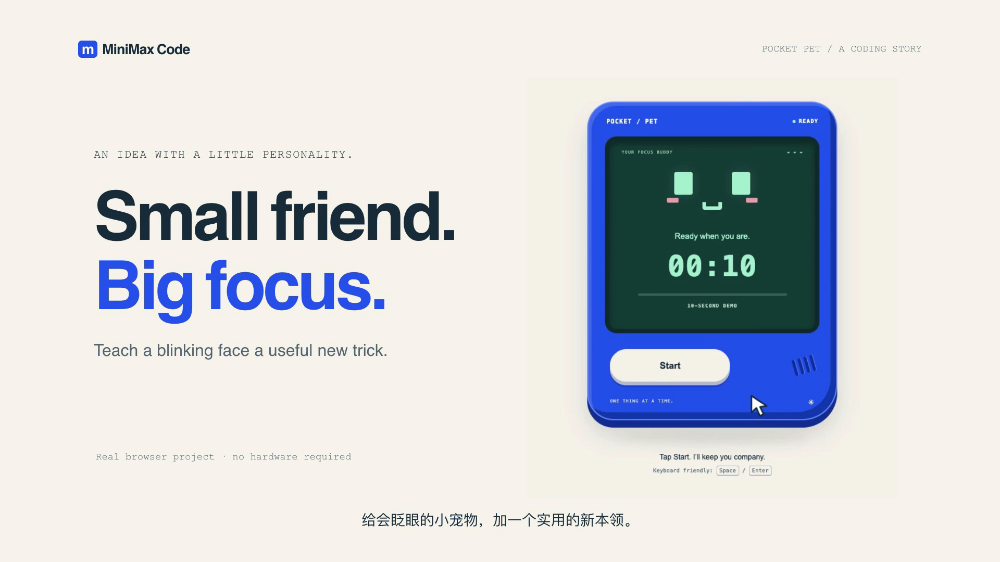

# Turn a prompt into something that works

[Watch or download the 36-second video](assets/pocket-pet-demo.mp4) · [Build it yourself](../examples/pocket-pet) · [View the finished source](../examples/pocket-pet/finished)

## A new feature, then a new requirement

The starter is a small, predesigned browser pet that blinks and says hello. The first request asks MiniMax Code to add a Pomodoro timer. The follow-up changes pause to an 800 ms hold and adds a completion celebration. The finished example runs locally without hardware or frontend dependencies.

The video pairs actual browser recordings with clearly labeled prompt excerpts, generated source, and excerpts of real headless output. The interface shown in the final demonstration includes subsequent maintainer design work. It is an edited demonstration, not a recording of the interactive TUI. See the [full prompts](../examples/pocket-pet) and try the same changes in your own copy.

## Recording and verification

- Recorded on September 28–29, 2026 (Asia/Shanghai), using the installed MiniMax Code **0.5.8**, with the existing **BYOK** configuration. This is a CLI workflow demonstration, not a MiniMax-model evaluation.
- The two real agent turns took approximately **102 seconds** and **154 seconds**. Model waiting time is omitted from the 36-second edit; it is not a speed benchmark. Browser footage plays at its captured speed.
- The first run added the timer and passed 6 tests. The follow-up added hold-to-pause and the celebration and passed all 13 tests. Both runs explicitly said browser behavior was unverified; the maintainer then checked it in Chrome.
- Browser checks cover start, short-click behavior, pointer hold/pause/resume, keyboard hold/repeat/release/resume, the default 25-minute setting, canceled holds, completion, reduced-motion behavior, and a 390 px viewport without horizontal overflow.
- `?demo=1` visibly labels a **10-second demonstration**. No 25-minute wait or physical hardware operation is implied. State is in memory and a page reload resets it.
- The visual starter was authored before the agent runs. The reference implementation retains the generated timer and hold logic. Subsequent maintainer work redesigned the HTML/CSS, added session-progress and short-tap feedback, made the mode links visible, avoided repeated live-region text writes, and canceled pending holds when the button loses focus. This visual polish was not produced by the two recorded CLI turns. The video does not claim generation from an empty project.
- Only synthetic project content appears. Private run logs, account state, provider aliases, local paths and session identifiers are excluded. Captions and layout are editorial; the cursor highlight follows actual pointer events. Browser footage is cropped for readability and its interaction segment plays continuously at 1×. No tool results were invented.
- Video assembly uses HyperFrames with locally staged browser footage. The video is silent so it works in muted README and social contexts. The revised cut uses a warm page and a cobalt device, with larger interaction shots and visible action labels.

To edit the starter, install and configure MCode with a MiniMax account with available credits or your own compatible model API. Calls may incur charges. Running the finished example requires only Node.js and a browser.

---

## Earlier demo: a small code repair

[Play or download the MP4](assets/tui-demo.mp4) · [View the full-size still](assets/tui-demo.png) · [Example source](../examples/clamp)

## What was recorded

The interactive TUI built from this repository ran in a temporary directory containing only `clamp.mjs` and `clamp.test.mjs`, using an existing MiniMax Token Plan login and `MiniMax-M3`. The model actually read the files, ran `node --test`, edited the function, and reran the tests. Initially two failed and one passed; after the fix, all three passed. The test file was unchanged.

The recorded task:

> Read clamp.mjs and clamp.test.mjs. Run node --test to reproduce the failure, fix clamp without changing the tests, then run the tests again. Reply briefly in English.

Full access was used only for this isolated synthetic project. Use `/permission` to choose an appropriate mode for your own work.

## Recording and editing

- Recorded on 2026-09-11 from source commit `fe49bbd73d4bb2df6e5873801af12695378c0b62`, TUI version 0.3.11.
- Actual ANSI output was captured through a PTY and replayed at 110 columns × 36 rows. Application text, colors, and layout are retained; the outer window title and provenance caption are recording decoration.
- The still shows the same session after `Ctrl+O` expanded tool details and the viewport was scrolled upward, including the actual diff and test output.
- The 20-second edit keeps task order, shortens waits and thinking, and holds on the final diff and tests. **It is not real-time playback or a performance benchmark.** No model output, tool calls, or test results were fabricated.
- `@xterm/headless` interpreted terminal cells, which were rendered as SVG / PNG. FFmpeg encoded the GIF and silent H.264 MP4. A border keeps the dark terminal frame visible on both light and dark GitHub backgrounds.
- No private project, account page, or key was recorded, and no user test image was used. Raw recordings and runtime logs remain local and are not committed as release assets.

This demonstrates one small code repair, not acceptance of every project, provider, or tool. See the [verification records](verification.md) for broader evidence.

## Brand assets

The README's light and dark wordmarks use the existing TUI welcome logo, with blue and cyan from its theme. `assets/social-preview.png` is a local 1280 × 640 sharing card for maintainers to configure as the GitHub Social Preview at release time. Creating these assets does not publish the repository; nothing was uploaded to a third-party media host.
