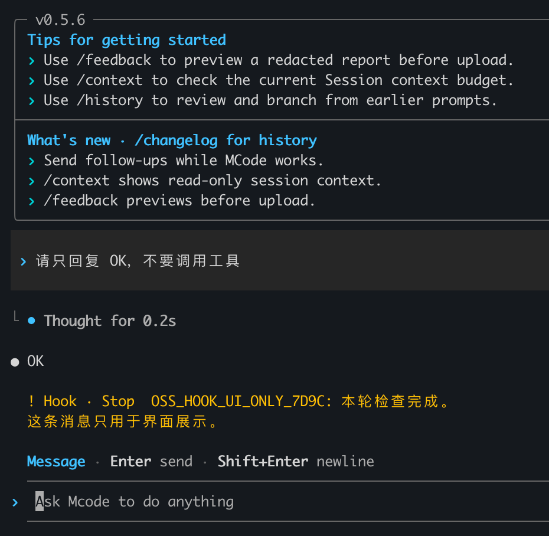

# Hook messages in the TUI

A synchronous command Hook can return a top-level `systemMessage` to show a
notice to the user without adding that text to model context:

```json
{"systemMessage":"Checks complete. The report is ready."}
```

Write one JSON object to stdout and exit with code 0. For example, a Node.js
script can use `console.log(JSON.stringify({ systemMessage: "Checks complete." }))`.
This is the script's output, not the Hook registration document.

For a MiniMax-format Plugin, reference the Hook file in the manifest's `hooks`
array, for example `"hooks": ["hooks/notify.json"]`. A registration document for
an existing Plugin with a `scripts/notice.cjs` file looks like this:

```json
{
  "hooks": {
    "Stop": [{
      "hooks": [{
        "type": "command",
        "command": "node \"${PLUGIN_ROOT}/scripts/notice.cjs\"",
        "timeout": 5
      }]
    }]
  }
}
```

The command requires Node.js on the Hook process's PATH. See [local Plugin
management](examples.md#4-manage-plugins) for the active installation directory.

## Display and model context

On normal completion, a Stop notice appears after the response as `Hook · Stop`.
The warning color is presentation, not a failed-turn status. Multiline text is
supported; terminal control sequences in the message or title are stripped.



The notice is persisted in Session display history and restored when reopening
that Session. Replaying the same message does not duplicate it. Separate Hook
invocations can repeat the same text and each gets its own notice. Notices stay
in their owning Session; child-session notices are not broadcast to the parent.

`systemMessage` alone does not request another model call. Its text is excluded
from canonical model history, compaction input, final-answer copying and default
Markdown export. This does not mean it is excluded from local display storage.
If you also return `additionalContext`, `decision` or other control fields, those
fields keep their existing event-specific behavior. `suppressOutput` does not
control this notice.

Only categorized Plugin user messages are shown. Diagnostics, terminal-control
notices and older events without a category remain hidden. This change concerns
interactive TUI presentation; headless and ACP output policies are unchanged.

## Event limits

The same display behavior applies where Runtime already emits notices:
SessionStart/UserPromptSubmit, PreToolUse, PermissionRequest, PostToolUse,
SubagentStart/SubagentStop and automatic PostCompact. A cancelled or failed turn
does not fire the normal Stop Hook.

PreCompact and manual PostCompact do not currently emit these notices.
SessionEnd delivery is best-effort and is not guaranteed to appear before exit.
The Claude-compatible adapter discards `systemMessage` for PreCompact,
PostCompact and SessionEnd; the Codex adapter discards it for SessionEnd. These
format-specific limits are unchanged. Only synchronous command Hooks are covered.

## Manual check from a source build

Build with `pnpm build` in the repository. To select a test workspace, change the
shell's working directory before launching the built CLI by its absolute path.
The interactive TUI does not accept the headless `exec --cwd` option.

With a dedicated `MINIMAX_DATA_DIR` and an enabled test Plugin:

1. Ask for a short answer without tools. Confirm one Stop notice after completion.
2. Repeat the prompt. Confirm a second notice even when its text is identical.
3. Switch away and reopen the Session, then restart the CLI. Confirm the notices
   are retained without duplication.
4. Use `/copy` and `/export`. Confirm the notice text is absent.
5. Narrow the terminal and check multiline text remains readable.

Do not paste the notice marker into the prompt or ask the model to read the Hook
script when checking context isolation. For live request acceptance, inspect the
next model request and an actually executed compaction request. Model answers or
`/context` usage statistics alone cannot prove the marker was absent.
